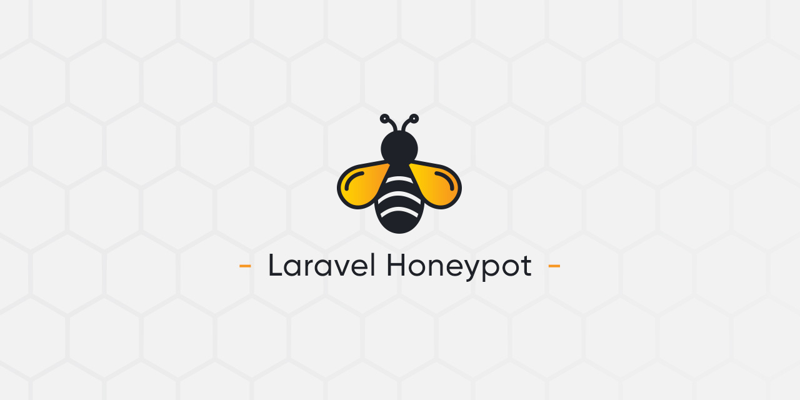

# Laravel Honeypot

Laravel Honeypot helps preventing bots from filling forms and creating spam. It uses a 2 inputs protections technique by adding one input that should be empty after form submission (obviously bots will fill it) and one input with the encrypted timestamp of the loading page, that help tracking the delay during loading page and form submission (because bots submit forms quickly). Both inputs are hidden from the users and have randomized names.

<p align="center">
    
</p>

## Installation

You can install the package via composer (the package will automatically register itself) :

```bash
composer require weblogin/laravel-honeypot
```

Optionally, you can publish the `config` and `lang` files of the package :

```bash
php artisan vendor:publish --provider="WebLogin\LaravelHoneypot\ServiceProvider"
```

## Usage

You need to add the Blade component or Blade directive in your form. The only parameter is the name of your fake input (it's a basename the package will add a random suffix). Obviouly don't name it `honeypot`.

Blade component :

```html
<form method="POST">
    <x-honeypot name="field-name"/>
    ...
</form>
```

Blade directive :

```html
<form method="POST">
    @honeypot('field-name')
    ...
</form>
```

Then uses the `Honeypot` rule like any other `Validation rules` for this same input name, like so :

```php
use WebLogin\LaravelHoneypot\Rules\Honeypot;
...

$request->validate([
    'title'.     => ['required', 'max:120'],
    'content'.   => ['required', 'max:600'],
    'field-name' => [new Honeypot],
]);
```

## Configuration

You can change the default configuration by publishing the package `config` (see installation section). It will create a `honeypot.php` file in your config folder.

- `enabled` to enable or not the whole honeypot protection 
- `min_seconds` to select the minimum number of seconds to wait before submitting the form

## Translation

You can translate validation messages by publishing the package `lang` (see installation section) or you can translate it directly in your `lang/your-locale/validation.php` file by adding the needed keys :

```php
'honeypot' => [
    'pot'  => "Message when the field that should be empty is filled",
    'time' => "Message when the form is submitted too quickly",
],
```


## Credits

Inspired by the package <https://github.com/msurguy/Honeypot>.

## License

The MIT License (MIT). Please see [License File](LICENSE.md) for more information.
